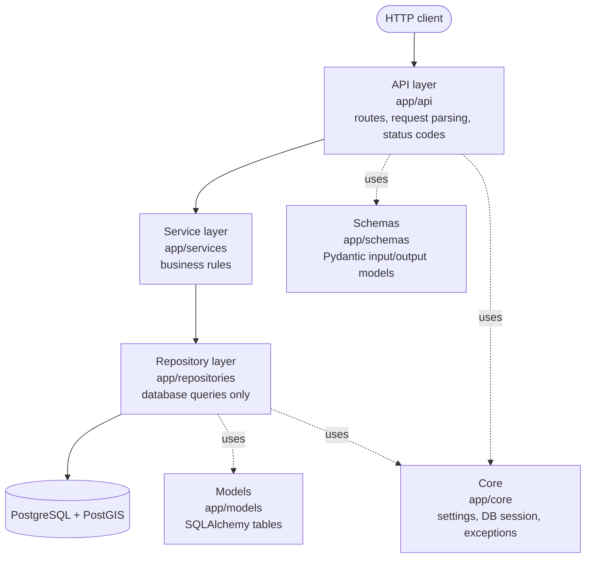
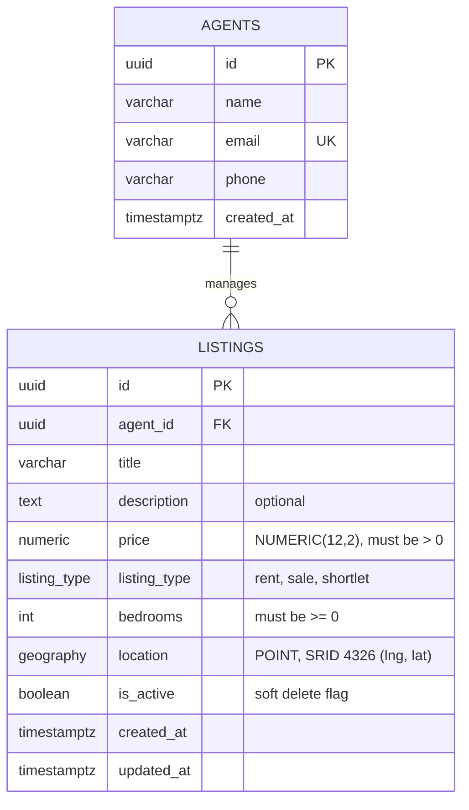

# Expert Listing Limited

A backend API for managing and searching property listings (rent, sale, shortlet), including radius-based geospatial search. Built with FastAPI, PostgreSQL and PostGIS, using a layered architecture.

> **Status:** work in progress.

## Overview

The API lets clients:

- Create, read, update and (soft) delete property listings
- Attach each listing to an agent
- Search listings by type, price range and bedrooms
- Find listings within X km of a given point
- Page through results with validated inputs and consistent error responses

### Tech stack

| Concern               | Choice                         |
| --------------------- | ------------------------------ |
| Language / framework  | Python 3.12, FastAPI           |
| Database              | PostgreSQL 16 + PostGIS 3.4    |
| ORM                   | SQLAlchemy 2.0 (sync)          |
| Migrations            | Alembic                        |
| Validation / settings | Pydantic v2, pydantic-settings |
| Package management    | uv                             |
| Containers            | Docker, Docker Compose         |
| Tests                 | pytest                         |

## Getting started

### Prerequisites

- [Docker](https://docs.docker.com/get-docker/) with Docker Compose
- [uv](https://docs.astral.sh/uv/) (only needed for running outside Docker)

### Run with Docker (recommended)

```bash
# 1. Create your local environment file
cp .env.example .env

# 2. Build and start the API and the database
docker compose up --build
```

Then check that everything is up:

```bash
curl http://localhost:8000/health         # {"status":"ok"}
curl http://localhost:8000/health/ready   # {"status":"ready"}
```

Interactive API docs are available at <http://localhost:8000/docs>.

Stop the stack with `Ctrl+C` or `docker compose down`. Add `-v` to also delete the database volume.

### Configuration

| Variable            | Description                                                                                                                   |
| ------------------- | ----------------------------------------------------------------------------------------------------------------------------- |
| `POSTGRES_USER`     | Database user (used by the `db` container and Compose)                                                                        |
| `POSTGRES_PASSWORD` | Database password                                                                                                             |
| `POSTGRES_DB`       | Database name                                                                                                                 |
| `DATABASE_URL`      | SQLAlchemy connection URL. Compose sets this for the API container; set it in `.env` only when running the API outside Docker |

### Database migrations

With the database running, apply the schema:

```bash
uv run alembic upgrade head
```

## Architecture

### Runtime topology


The `api` container waits for the database healthcheck (`pg_isready`) to pass before starting, so it never boots against a database that is not ready.

### Layered design

Each layer has one job and only talks to the layer directly below it.



| Layer      | Responsibility                                                     | Must not                             |
| ---------- | ------------------------------------------------------------------ | ------------------------------------ |
| API        | Parse and validate HTTP input, call a service, choose status codes | Contain business rules or SQL        |
| Service    | Enforce business rules (for example, the agent must exist)         | Know about HTTP or write raw queries |
| Repository | Read and write the database, including spatial queries             | Make business decisions              |

The payoff is testability and swap-ability: services can be tested without HTTP, and the persistence details (including PostGIS specifics) stay in one place.

### Project structure

```
.
├── app/
│   ├── main.py            # App assembly: creates FastAPI, includes routers
│   ├── api/               # Routers (health today; agents and listings next)
│   ├── core/
│   │   ├── config.py      # Typed settings loaded from the environment
│   │   └── database.py    # Engine, session factory, get_db dependency
│   ├── models/            # SQLAlchemy models        (planned)
│   ├── schemas/           # Pydantic schemas         (planned)
│   ├── repositories/      # Data access              (planned)
│   └── services/          # Business logic           (planned)
├── alembic/               # Migrations               (planned)
├── tests/                 # pytest suite             (planned)
├── Dockerfile
├── docker-compose.yml
├── pyproject.toml
└── uv.lock
```

### Key design decisions

- **PostGIS for geospatial search.** Location is stored as a `GEOGRAPHY(POINT, 4326)` with a GiST index, so radius queries (`ST_DWithin`) run inside the database using real-world distances in metres, instead of scanning rows in Python.
- **Sync SQLAlchemy with plain `def` endpoints.** FastAPI runs them in a threadpool. This keeps the code and tests simple and avoids event-loop pitfalls; the trade-off is lower peak concurrency than a fully async stack.
- **Session per request.** A session is opened by the `get_db` dependency and always closed at the end of the request. Sessions are never shared.
- **`expire_on_commit=False`.** Avoids hidden reload queries when serialising objects after a commit.
- **`pool_pre_ping=True`.** Stale connections (for example after a database restart) are detected and replaced.
- **Liveness and readiness are separate.** `/health` never touches the database. `/health/ready` does, and returns `503` if it is unreachable. A database outage should stop traffic, not cause healthy API containers to be restarted.
- **Soft delete.** Listings carry an `is_active` flag; deleted listings are hidden from every read.
- **Money as `NUMERIC`, never float.**
- **Reproducible builds.** Dependencies are pinned in `uv.lock`, installed with `uv sync --locked` in a cached Docker layer.

## Data model

Current planned schema (created by the first migration).



Notes:

- The API accepts and returns plain `latitude` and `longitude`. Conversion to and from the geography column happens in the repository layer. PostGIS points are ordered **(longitude, latitude)**.
- `agent_id` uses `ON DELETE RESTRICT`, so an agent with listings cannot be deleted.
- Planned indexes: GiST on `location`, btree on `(listing_type, price)`, and on `bedrooms` and `agent_id`.

## API

Available now:

| Method | Path            | Description                               |
| ------ | --------------- | ----------------------------------------- |
| GET    | `/health`       | Liveness: is the process up               |
| GET    | `/health/ready` | Readiness: can the app reach the database |

Planned:

| Method | Path             | Description                                                                                   |
| ------ | ---------------- | --------------------------------------------------------------------------------------------- |
| POST   | `/agents`        | Create an agent                                                                               |
| POST   | `/listings`      | Create a listing                                                                              |
| GET    | `/listings/{id}` | Get a listing                                                                                 |
| PATCH  | `/listings/{id}` | Partially update a listing                                                                    |
| DELETE | `/listings/{id}` | Soft-delete a listing                                                                         |
| GET    | `/listings`      | Search and paginate: filters for type, price range, bedrooms, and `lat` / `lng` / `radius_km` |
