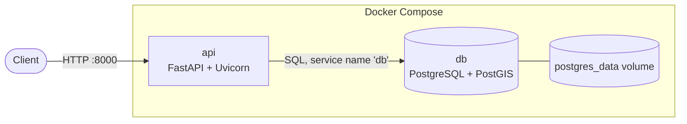
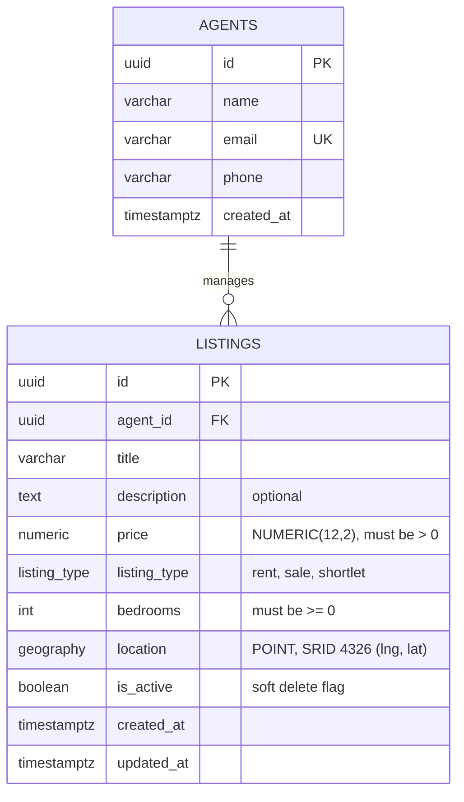

# Expert Listing Limited

A backend API for managing and searching property listings (rent, sale and shortlet), including search by distance from a point. Built with FastAPI, PostgreSQL and PostGIS.

## Features

- CRUD for listings, each belonging to an agent
- Search by type, price range and bedrooms
- Radius search: listings within X km of a point, nearest first, with the distance returned
- Pagination, input validation and one consistent error format
- Migrations, seed data, tests and CI

## Getting started

You only need Docker.

```bash
git clone <repo-url>
cd <repo>
cp .env.example .env          # on Windows: copy .env.example .env
docker compose up --build -d
```

### Database migrations

With the database running, apply the schema:

```bash
docker compose exec api alembic upgrade head
```

### Seed sample data

```bash
docker compose exec api python -m app.seed            # adds 3 agents and 24 Lagos listings; safe to re-run
```

The defaults in `.env.example` work as they are. The API runs on <http://localhost:8000> and PostgreSQL (with PostGIS) on port 5432.

Check that it works:

```bash
curl http://localhost:8000/health/ready
curl "http://localhost:8000/listings?latitude=6.4478&longitude=3.4723&radius_km=5"
```

Interactive docs (Swagger UI) are at <http://localhost:8000/docs>.

The seed script adds 3 agents and 24 listings across Lagos. It is safe to run more than once, and `python -m app.seed --reset` wipes everything and starts again. Coordinates are approximate neighbourhood centres, not real addresses.

To stop everything: `docker compose down` (add `-v` to delete the database too).

### Tests

The production image leaves out dev dependencies, so the tests run from a local checkout with [uv](https://docs.astral.sh/uv/):

```bash
docker compose up -d db
uv run pytest
```

They run against a separate `listings_db_test` database that is rebuilt from the migrations on every run. GitHub Actions runs lint, a migration up/down check, the seed script, the full test suite and a Docker build on every push.

## Architecture

### Runtime topology



The `api` container waits for the database healthcheck (`pg_isready`) to pass before starting, so it never boots against a database that is not ready.

### Layered design

Each layer has one job and only talks to the layer directly below it.


| Layer      | Responsibility                                                     | Must not                             |
| ---------- | ------------------------------------------------------------------ | ------------------------------------ |
| API        | Parse and validate HTTP input, call a service, choose status codes | Contain business rules or SQL        |
| Service    | Enforce business rules (for example, the agent must exist)         | Know about HTTP or write raw queries |
| Repository | Read and write the database, including spatial queries             | Make business decisions              |

The payoff is testability and swap-ability: services can be tested without HTTP, and the persistence details (including PostGIS specifics) stay in one place.

## Data model



## API

Base URL: `http://localhost:8000`

| Method | Path             | Description                          |
| ------ | ---------------- | ------------------------------------ |
| GET    | `/health`        | Liveness: the process is up          |
| GET    | `/health/ready`  | Readiness: the database is reachable |
| POST   | `/agents`        | Create an agent                      |
| GET    | `/agents/{id}`   | Get an agent                         |
| POST   | `/listings`      | Create a listing                     |
| GET    | `/listings`      | Search and paginate listings         |
| GET    | `/listings/{id}` | Get a listing                        |
| PATCH  | `/listings/{id}` | Update some fields of a listing      |
| DELETE | `/listings/{id}` | Delete a listing (soft delete)       |

### Creating a listing

`agent_id` comes from `POST /agents`, or from any seeded listing.

```bash
curl -X POST http://localhost:8000/listings \
  -H "Content-Type: application/json" \
  -d '{
    "agent_id": "<agent id>",
    "title": "Bright 2-bedroom apartment in Lekki Phase 1",
    "description": "Tiled throughout, 24/7 power backup.",
    "price": "4500000",
    "listing_type": "rent",
    "bedrooms": 2,
    "latitude": 6.4478,
    "longitude": 3.4723
  }'
```

`listing_type` is `rent`, `sale` or `shortlet`. `description` is optional. The response is `201` with the created listing and a `Location` header. `PATCH` accepts any subset of `title`, `description`, `price`, `listing_type`, `bedrooms` and `latitude` + `longitude` (the two must be sent together).

### Searching listings

Every parameter is optional and they combine with AND.

| Parameter                            | Description                                                                              |
| ------------------------------------ | ---------------------------------------------------------------------------------------- |
| `listing_type`                       | `rent`, `sale` or `shortlet`                                                             |
| `min_price`, `max_price`             | Price range, inclusive                                                                   |
| `min_bedrooms`, `max_bedrooms`       | Bedroom range, inclusive (`0` is a studio)                                               |
| `latitude`, `longitude`, `radius_km` | Only listings within `radius_km` (max 100) of the point. All three are required together |
| `limit`                              | Page size, default 20, max 100                                                           |
| `offset`                             | Results to skip, default 0, max 10,000                                                   |

With a location filter, results are sorted nearest first and each one includes `distance_km`. Without one, they are sorted newest first and `distance_km` is `null`.

```bash
curl "http://localhost:8000/listings?listing_type=rent&min_bedrooms=2&latitude=6.4478&longitude=3.4723&radius_km=5"
```

```json
{
  "items": [
    {
      "id": "…",
      "agent_id": "…",
      "title": "Bright 2-bedroom apartment in Lekki Phase 1",
      "description": "Tiled throughout, 24/7 power backup, close to shops.",
      "price": "4500000.00",
      "listing_type": "rent",
      "bedrooms": 2,
      "latitude": 6.4478,
      "longitude": 3.4723,
      "created_at": "…",
      "updated_at": "…",
      "distance_km": 0.0
    }
  ],
  "total": 1,
  "limit": 20,
  "offset": 0
}
```

`total` counts all matches across pages, so there are more results when `offset + len(items) < total`. Price is returned as a string on purpose, so clients never round money through a float.

### Errors

Every error, including unknown routes and wrong methods, has the same shape:

```json
{
  "error": {
    "code": "validation_error",
    "message": "Request validation failed",
    "details": [
      { "field": "body.price", "message": "Input should be greater than 0" }
    ]
  }
}
```

`code` is stable, so clients can branch on it. `details` only appears for validation errors.

| Status | Meaning                                                                      |
| ------ | ---------------------------------------------------------------------------- |
| 404    | The resource in the URL does not exist, or the listing was deleted           |
| 409    | The request clashes with existing data (for example a duplicate agent email) |
| 422    | Invalid input, or an `agent_id` in the body that does not exist              |
| 503    | The database is unavailable                                                  |
| 500    | Unexpected error. Details go to the server logs only                         |

## Design choices

**Stack.** FastAPI, PostgreSQL with PostGIS, SQLAlchemy 2.0 and Alembic. I chose FastAPI because I work with it a lot and Pydantic handles most of the input validation. It's also plain sync SQLAlchemy with normal `def` endpoints. Async would add complexity to the code and the tests without helping much at this size. For a bigger product with internal tools, like reviewing agents and moderating listings, I would look at Django for its admin and GeoDjango.

**Layers.** Routes only deal with HTTP. Services hold the business rules and own the transaction, and repositories hold the queries. Services raise their own errors (not found, conflict) and know nothing about status codes. One module maps those errors to HTTP in a single place. Repositories flush but never commit, so each business operation is exactly one transaction. Because of this split, I could test the rules with mocks and the queries against a real database.

**Geo search stays in the database.** Location is a PostGIS `geography` point with a GiST index. The radius filter is `ST_DWithin`, which works in real metres on the Earth's surface and can use the index. Distance comes back from the same query. I could have done a Haversine calculation over every row, and it would look fine with 24 listings, but it wouldn't survive 500,000. The API only deals in `latitude` and `longitude`. The conversion happens in the repository, and PostGIS wants longitude first, so there is a test that stores a point and reads the raw coordinates back.

**Validation in two places.** Pydantic rejects bad input early with readable messages: coordinate ranges, positive price, a strict enum, unknown fields. The database also enforces the important rules (`price > 0`, `bedrooms >= 0`, unique agent email, foreign keys), because the API isn't the only thing that will ever write to it. Request schemas are separate from the ORM models, so a client can never set `id`, `is_active` or timestamps.

**Money.** Prices are `NUMERIC(12,2)` in the database and `Decimal` in the code, and they come back as strings. Floats and money don't mix.

**Soft delete.** `DELETE` sets `is_active = false`. The row stays for history, but every read ignores it, and that filter lives in one place, the repository. Deleting the same listing twice returns 404, because as far as the API is concerned it's already gone.

**Search and pagination.** Search is a filtered version of `GET /listings`, not a separate endpoint. I made bedrooms a min/max range because the spec only says "bedrooms", and an exact match is just min equal to max. A radius search needs all three location parameters, and a partial one is rejected instead of guessed. Pagination is offset-based with caps on both limit and offset. Every ordering ends with `id`, otherwise rows that tie on the sort key can show up on two pages or none. `total` is a separate count query over the same filters, so the two can't disagree.

**Errors.** One envelope for everything. Validation errors only expose the field and the message, never the input the client sent. Database and unexpected errors return a generic message, and the details are logged on the server.

**Testing.** Most tests run against a real PostGIS database, not mocks, because the interesting bugs are in the spatial queries, not in Python. The test database is dropped and rebuilt from the migrations at the start of each run, and every test runs in a transaction that gets rolled back. Schemas and services also have plain unit tests.

**Assumptions.**

- There is no authentication, since the task didn't ask for it. Agents can be created and fetched, nothing more.
- Price is a single field. In the seed data, rent is per year, shortlet is per night and sale is the total price, all in naira. The API doesn't enforce that.
- An unknown `agent_id` in a request body is a 422, not a 404. The URL is valid, the body is the problem.

## What I would improve

**Authentication, permissions and rate limiting.** Agents would log in (JWT) and only be able to edit or delete their own listings. Rate limiting would go in front with Redis: a sliding window per IP for anonymous traffic and per token for logged-in users, tighter on writes and on expensive searches, answering with `429` and a `Retry-After` header.

**"Near me" from the device location.** A phone or browser can give the client its coordinates once the user allows it, and the client can already send them as `latitude` and `longitude`. What's missing on the API side is a sensible default radius, a `sort=distance` option, and a fallback to approximate IP-based location when permission is denied. The coordinates would only be used for that request and never stored.

**Listing images.** A `listing_images` table with a URL, a position and a cover flag, with the files in S3-compatible object storage. Clients would upload straight to the bucket using presigned URLs, so the API never handles the image bytes, and a background job would generate thumbnails.

**A real search engine.** Postgres handles filters and distance well, but not typo-tolerant text search like "2 bed lekki". I'd add Meilisearch or Elasticsearch with geo filters and facets, keep Postgres as the source of truth, and update the index through an outbox table and a worker so the two can't silently drift apart.

**Keyset pagination and sorting.** A cursor built from the sort value plus `id` keeps deep pages fast and stable when listings are added or removed between requests. This would come with a `sort` parameter for newest, price and nearest.

**Caching.** Redis cache-aside for `GET /listings/{id}` and popular searches with short TTLs, cleared on writes. For location searches I'd round the centre point to a coarse grid, roughly 100 m, so nearby users hit the same cache entry.

**Verified listings and price history.** A status (`pending`, `verified`, `rejected`) with the reviewer and timestamp, plus a `price_history` table that records every price change. That would fit a platform built on trust in its data and would allow price trends per neighbourhood.

**Map viewport search.** A `bbox` parameter (`minLng,minLat,maxLng,maxLat`) using `ST_MakeEnvelope` and the GiST index, with server-side clustering (grid snapping or `ST_ClusterDBSCAN`) so a map view can show thousands of listings as clusters that split as the user zooms in.
